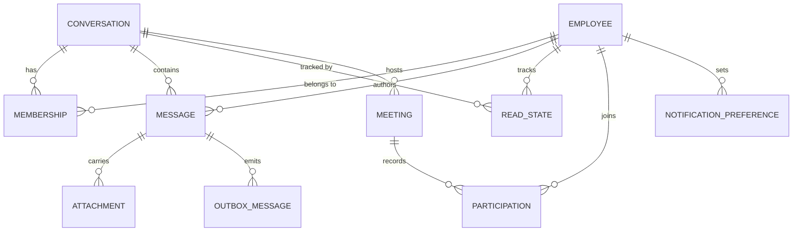

# Phase 1 Data Model: Enterprise Internal Chat Platform

**Date**: 2026-07-31 | **Plan**: [plan.md](./plan.md) | **Research**: [research.md](./research.md)

PostgreSQL is the sole source of truth (Constitution Principle VII). Redis holds only derived,
TTL-bounded copies. Every table below is authoritative; nothing in Redis or MinIO can contradict it
without PostgreSQL winning.

Naming is `snake_case` in the database and `PascalCase` in the domain. Identifiers are UUIDv7
(time-ordered, index-friendly) except where a sequence is required by D1.

---

## Entity overview



---

## employee

Projection of the corporate directory. The platform never owns employee lifecycle (FR-001) and
never stores a password.

| Column | Type | Constraints | Notes |
| --- | --- | --- | --- |
| `id` | `uuid` | PK | Stable internal id |
| `external_subject` | `text` | UNIQUE NOT NULL | Keycloak `sub` claim |
| `display_name` | `text` | NOT NULL | |
| `email` | `citext` | UNIQUE NOT NULL | |
| `avatar_url` | `text` | NULL | |
| `status` | `employee_status` | NOT NULL DEFAULT `'active'` | `active` \| `deactivated` |
| `deactivated_at` | `timestamptz` | NULL | Set by directory sync |
| `created_at` / `updated_at` | `timestamptz` | NOT NULL | |

**Indexes**: `external_subject` (unique), `email` (unique), GIN trigram on `display_name` for
directory search (FR-007).

**Rules**:

- A `deactivated` employee MUST NOT be addable to a conversation (FR-007, edge case
  "deactivated employee's history").
- Deactivation never deletes authored messages; they remain visible with an inactive marker.
- **State transitions**: `active → deactivated` (directory sync). `deactivated → active` on
  rehire. No other transitions.

---

## conversation

| Column | Type | Constraints | Notes |
| --- | --- | --- | --- |
| `id` | `uuid` | PK | |
| `kind` | `conversation_kind` | NOT NULL | `direct` \| `group` |
| `name` | `text` | NULL, NOT NULL when `kind = 'group'` | CHECK constraint |
| `created_by` | `uuid` | FK → `employee.id` | |
| `history_visibility` | `history_visibility` | NOT NULL DEFAULT `'from_join'` | `from_join` \| `full` |
| `last_seq` | `bigint` | NOT NULL DEFAULT 0 | Per-conversation sequence allocator (D1) |
| `direct_key` | `text` | NULL, UNIQUE | Canonical sorted pair of employee ids; `NULL` for groups |
| `created_at` / `updated_at` | `timestamptz` | NOT NULL | |

**Indexes**: `direct_key` (unique, partial `WHERE kind = 'direct'`).

**Rules**:

- `direct_key` is the two participant ids sorted and joined. The unique index is what prevents two
  direct conversations existing between the same pair when both click "message" simultaneously.
- A `direct` conversation MUST have exactly two memberships and they MUST NOT be removable.
- `last_seq` is incremented by `UPDATE ... RETURNING` inside the send transaction (D1). It is never
  read for display, only for allocation.
- `history_visibility` is fixed at creation (FR/US3 scenario 4) and displayed to members.

---

## membership

The authorization record. Every access decision in the system resolves to a row here.

| Column | Type | Constraints | Notes |
| --- | --- | --- | --- |
| `conversation_id` | `uuid` | PK part, FK | |
| `employee_id` | `uuid` | PK part, FK | |
| `role` | `membership_role` | NOT NULL DEFAULT `'member'` | `member` \| `admin` |
| `joined_at` | `timestamptz` | NOT NULL | |
| `visible_from_seq` | `bigint` | NOT NULL | History floor for this member |
| `muted_until` | `timestamptz` | NULL | FR-037 |
| `removed_at` | `timestamptz` | NULL | Soft removal, preserves audit trail |

**Indexes**: PK `(conversation_id, employee_id)`; `(employee_id, removed_at)` for conversation-list
queries; partial index `WHERE removed_at IS NULL` for the authorization lookup.

**Rules**:

- `visible_from_seq` is set to the conversation's current `last_seq` when
  `history_visibility = 'from_join'`, or `0` when `'full'`. History queries always filter
  `seq > visible_from_seq`, which is how FR/US3 scenario 4 is enforced in the query rather than in
  the UI.
- Removal sets `removed_at` and MUST invalidate the Redis membership cache in the same use case
  (Principle VII). A row with `removed_at IS NOT NULL` grants nothing — including for search
  (FR-032) and attachments (FR-025).
- **State transitions**: `(absent) → active` on add; `active → removed` on remove;
  `removed → active` on re-add, which re-evaluates `visible_from_seq` so a re-added member does not
  silently gain the history they lost.

---

## message

Partitioned by `RANGE (sent_at)`, one partition per month (D11).

| Column | Type | Constraints | Notes |
| --- | --- | --- | --- |
| `id` | `uuid` | PK part | |
| `conversation_id` | `uuid` | NOT NULL, FK | |
| `seq` | `bigint` | NOT NULL | Server-assigned, gapless per conversation (D1) |
| `author_id` | `uuid` | NOT NULL, FK | |
| `client_message_key` | `text` | NOT NULL | ULID supplied by the sender (D1) |
| `body` | `text` | NOT NULL, CHECK length ≤ 8000 | FR-019 |
| `body_tsv` | `tsvector` | GENERATED | `to_tsvector('simple', unaccent(body))` (D9) |
| `sent_at` | `timestamptz` | NOT NULL, partition key | Server clock, never the client's (FR-012) |
| `edited_at` | `timestamptz` | NULL | FR-014 |
| `deleted_at` | `timestamptz` | NULL | Soft delete; body cleared, tombstone retained |
| `mentions` | `uuid[]` | NOT NULL DEFAULT `'{}'` | Resolved at send time (FR-015) |

**Indexes**:

- PK `(id, sent_at)` — partition key must be in the PK.
- `(conversation_id, seq DESC)` — history paging and ordering (FR-012, FR-013). **Not unique**; see
  below.
- GIN on `body_tsv` — search (FR-029).

> **Correction (T088).** This section previously specified
> `UNIQUE (conversation_id, client_message_key)` on `message` and called it "the entire exactly-once
> guarantee", plus `UNIQUE (conversation_id, seq)`. **Neither index can exist**, and the reason is
> not a limitation to work around:
>
> ```
> ERROR: unique constraint on partitioned table must include all partitioning columns
> DETAIL: UNIQUE constraint on table "message" lacks column "sent_at" which is part of
>         the partition key.
> ```
>
> Widening either to include `sent_at` would be worse than dropping it. `sent_at` is assigned by the
> server at insert, so a retried send carries a *different* timestamp, the composite differs, and the
> duplicate is admitted — an index that reads like a guarantee and enforces nothing. D1 needs
> uniqueness spanning every partition; D11 needs monthly RANGE partitioning so retention is a
> `DROP PARTITION`. The two requirements are in genuine tension.
>
> Resolved as follows:
>
> - **Exactly-once (FR-011)** moves to `message_dedup`, an un-partitioned table whose primary key
>   *is* the constraint. See below.
> - **`(conversation_id, seq)` uniqueness** is dropped to a plain index. Uniqueness is already
>   guaranteed upstream: the sequence is allocated by `UPDATE ... RETURNING` under a row lock
>   (D1), so the index was a backstop rather than the mechanism.

---

## message_dedup

The exactly-once guarantee (FR-011). Deliberately **not** partitioned, so its primary key can span
every month.

| Column | Type | Constraints | Notes |
| --- | --- | --- | --- |
| `conversation_id` | `uuid` | PK part | |
| `client_message_key` | `text` | PK part | ULID supplied by the sender (D1) |
| `message_id` | `uuid` | NOT NULL | The message this key produced |
| `sent_at` | `timestamptz` | NOT NULL | The winner's send time |

**Indexes**: PK `(conversation_id, client_message_key)` — this is the constraint a concurrent retry
collides on; `(sent_at)` for the retention sweep.

**Rules**:

- The send path inserts here **first**, with `ON CONFLICT DO NOTHING`. Zero rows affected means a
  retry: the handler reads the winning row and returns that message rather than inserting a second
  one. A `SELECT`-then-`INSERT` would not do — two concurrent attempts both see nothing and both
  insert.
- `sent_at` is carried for two reasons: the retention sweep deletes these rows by the same month
  range it drops a partition for, and reading the winning message back requires it because
  `message`'s primary key is `(id, sent_at)`.
- **No foreign key to `message`.** One would have to include the partition key, and it would then
  block the partition drop that retention depends on.

**Rules**:

- Insert and `last_seq` allocation happen in one transaction. A unique violation on
  `(conversation_id, client_message_key)` is not an error: the handler returns the existing message,
  which is what makes a client retry idempotent.
- Editing sets `body`, `edited_at`, and regenerates `body_tsv`. `sent_at` and `seq` never change, so
  ordering is stable and search reflects current content (FR-032).
- Deleting clears `body` and sets `deleted_at`. The row survives so that ordering, sequence
  continuity, and the audit trail remain intact — a deleted message renders as a tombstone.
- Edit and delete are refused beyond 24 hours after `sent_at` (spec Assumptions).
- **State transitions**: `sent → edited` (repeatable, within window); `sent → deleted` or
  `edited → deleted` (terminal); `deleted` has no outbound transitions.

---

## attachment

| Column | Type | Constraints | Notes |
| --- | --- | --- | --- |
| `id` | `uuid` | PK | |
| `message_id` | `uuid` | NULL, FK | NULL until the message is sent |
| `conversation_id` | `uuid` | NOT NULL, FK | Denormalized so authorization needs no join |
| `uploaded_by` | `uuid` | NOT NULL, FK | |
| `kind` | `attachment_kind` | NOT NULL | `image` \| `video` |
| `content_type` | `text` | NOT NULL | Allow-list enforced (FR-023) |
| `byte_size` | `bigint` | NOT NULL, CHECK ≤ limit per kind | 25 MB image, 500 MB video |
| `duration_seconds` | `int` | NULL, CHECK ≤ 600 for video | FR-023 |
| `object_key` | `text` | NOT NULL | MinIO key |
| `poster_object_key` | `text` | NULL | Video poster frame (D8) |
| `scan_status` | `scan_status` | NOT NULL DEFAULT `'pending'` | `pending` \| `clean` \| `infected` \| `failed` |
| `scanned_at` | `timestamptz` | NULL | |
| `created_at` | `timestamptz` | NOT NULL | |

**Indexes**: `(conversation_id)`, `(message_id)`, `(scan_status)` partial `WHERE scan_status = 'pending'`.

**Rules**:

- `conversation_id` is denormalized deliberately: the download authorization check must not require
  joining through `message`, because a message may not exist yet at upload time and because the
  check is on the hot path for every image render.
- An attachment is retrievable **only** when `scan_status = 'clean'` AND its message is not deleted
  AND the requester holds an active membership (FR-024, FR-025, FR-027).
- `infected` attachments are purged from MinIO and the uploader is notified; the row is retained for
  audit.
- **State transitions**: `pending → clean` | `pending → infected` | `pending → failed`;
  `failed → pending` on retry. `clean` and `infected` are terminal.

---

## read_state

| Column | Type | Constraints | Notes |
| --- | --- | --- | --- |
| `employee_id` | `uuid` | PK part, FK | |
| `conversation_id` | `uuid` | PK part, FK | |
| `last_read_seq` | `bigint` | NOT NULL DEFAULT 0 | |
| `updated_at` | `timestamptz` | NOT NULL | |

**Rules**:

- Unread count is `last_seq - GREATEST(last_read_seq, visible_from_seq)`, computed rather than
  stored, so it cannot drift.
- `last_read_seq` only ever moves forward — a `GREATEST` update, never an assignment. This is what
  makes FR-036 (consistency across devices) safe when two devices report reads out of order.
- Every change publishes `chat.read_state.updated.v1` so the employee's other devices update
  (FR-036).

---

## notification_preference

| Column | Type | Constraints | Notes |
| --- | --- | --- | --- |
| `employee_id` | `uuid` | PK, FK | |
| `dnd_start` / `dnd_end` | `time` | NULL | Local do-not-disturb window (FR-037) |
| `time_zone` | `text` | NOT NULL DEFAULT `'UTC'` | IANA id; DND is meaningless without it |
| `digest_after_minutes` | `int` | NOT NULL DEFAULT 60 | Backlog batching threshold (FR-038) |

## push_subscription

| Column | Type | Constraints | Notes |
| --- | --- | --- | --- |
| `id` | `uuid` | PK | |
| `employee_id` | `uuid` | NOT NULL, FK | |
| `endpoint` | `text` | UNIQUE NOT NULL | Browser push endpoint |
| `p256dh` / `auth` | `text` | NOT NULL | VAPID keys |
| `user_agent` | `text` | NULL | Shown in the device list |
| `created_at` / `last_success_at` | `timestamptz` | | |

**Rules**: a subscription rejected by the push service is deleted, not retried indefinitely. An
employee with zero live subscriptions is what FR-040 detects and surfaces.

---

## meeting / participation

| `meeting` column | Type | Constraints | Notes |
| --- | --- | --- | --- |
| `id` | `uuid` | PK | Also the LiveKit room name |
| `conversation_id` | `uuid` | NOT NULL, FK | Membership scope for joining (FR-041) |
| `started_by` | `uuid` | NOT NULL, FK | |
| `started_at` / `ended_at` | `timestamptz` | | |
| `peak_participants` | `int` | NOT NULL DEFAULT 0 | Capacity observability (FR-043) |

| `participation` column | Type | Constraints | Notes |
| --- | --- | --- | --- |
| `meeting_id` / `employee_id` | `uuid` | PK part, FK | |
| `joined_at` / `left_at` | `timestamptz` | | Audit (FR-051) |
| `shared_screen_seconds` | `int` | NOT NULL DEFAULT 0 | |

**Rules**:

- A meeting is refused when the room holds 25 participants (FR-042) or when the platform-wide
  concurrent participant count reaches 1,250 (FR-043, FR-044). The platform-wide counter lives in
  Redis with a TTL and is reconciled from LiveKit webhooks — it is a capacity guard, not an
  authorization decision, so cache authority here is acceptable under Principle VII.
- Ending is driven by LiveKit webhooks, not by the starter leaving (FR-047).
- **State transitions**: `active → ended` (terminal). No reopening; a new meeting gets a new row.

---

## outbox_message

The atomicity mechanism for Principle VI (D2).

| Column | Type | Constraints | Notes |
| --- | --- | --- | --- |
| `id` | `uuid` | PK | Becomes the AMQP message id |
| `type` | `text` | NOT NULL | e.g. `chat.message.sent.v1` |
| `payload` | `jsonb` | NOT NULL | |
| `occurred_at` | `timestamptz` | NOT NULL | |
| `dispatched_at` | `timestamptz` | NULL | Set only after a publisher confirm |
| `attempts` | `int` | NOT NULL DEFAULT 0 | |

**Indexes**: partial `(occurred_at) WHERE dispatched_at IS NULL` — the dispatcher's only query.

**Rules**: written in the same transaction as the state change it describes. The dispatcher claims
rows with `FOR UPDATE SKIP LOCKED` and marks them dispatched only after RabbitMQ confirms.

## processed_message

| Column | Type | Constraints |
| --- | --- | --- |
| `consumer_name` | `text` | PK part |
| `message_id` | `uuid` | PK part |
| `processed_at` | `timestamptz` | NOT NULL |

**Rules**: every consumer checks and inserts here inside its handling transaction. This is what
makes at-least-once delivery safe (Principle VI). Rows are pruned after 30 days.

---

## audit_event

Append-only. No `UPDATE` or `DELETE` grant is issued to the application role (Principle IV, FR-006).

| Column | Type | Constraints | Notes |
| --- | --- | --- | --- |
| `id` | `bigint` | PK, identity | |
| `occurred_at` | `timestamptz` | NOT NULL | |
| `actor_id` | `uuid` | NULL, FK | NULL for system actions |
| `action` | `text` | NOT NULL | e.g. `membership.removed` |
| `subject_type` / `subject_id` | `text` / `uuid` | NOT NULL / NULL | |
| `source_ip` | `inet` | NULL | |
| `outcome` | `audit_outcome` | NOT NULL | `success` \| `denied` \| `error` |
| `detail` | `jsonb` | NOT NULL DEFAULT `'{}'` | Never message bodies (FR-056) |

**Indexes**: `(subject_type, subject_id, occurred_at DESC)` — this is the index that makes SC-021's
"who had access on this date, in under 10 minutes" achievable.

**Retention**: 1 year minimum (constitution). Audit retention is independent of message
retention — deleting a message does not delete the record that it was deleted.

---

## Redis keyspace

Derived only. Every key has a TTL (Principle VII).

| Key | Type | TTL | Purpose |
| --- | --- | --- | --- |
| `internalchat:{env}:membership:{conv}:{emp}` | string | 30 s | Authorization cache (D6) |
| `internalchat:{env}:presence:{emp}` | string | 60 s | Availability (FR-017) |
| `internalchat:{env}:typing:{conv}` | set | 10 s | Typing indicators (FR-016) |
| `internalchat:{env}:revoked:{session}` | string | = max token life | Revocation set (D5) |
| `internalchat:{env}:meeting:participants` | counter | 5 min | Platform capacity guard (FR-043) |
| `signalr:*` | — | managed | SignalR backplane |

Losing the entire keyspace costs latency and transient state (typing, presence) only — never data,
never an incorrect authorization decision, which is what SC-024 asserts.

---

## MinIO layout

| Bucket | Purpose | Access |
| --- | --- | --- |
| `attachments-quarantine` | Uploads awaiting a scan verdict | No path is ever served from here |
| `attachments` | Clean objects | Reachable only via nginx internal redirect (D7) |

Object key: `{conversation_id}/{attachment_id}` — no employee-guessable structure, though the key
is not a security control; the membership check is.

---

## Validation rules summary

Domain invariants that MUST be unit-tested (Principle III):

1. Message body length 1–8000 characters; whitespace-only is rejected (FR-019).
2. `client_message_key` is a well-formed ULID and required on every send (FR-011).
3. A direct conversation has exactly two memberships, neither removable.
4. A group conversation requires a non-empty name.
5. Edit and delete are refused beyond 24 hours after `sent_at`.
6. A deactivated employee cannot be added to a conversation.
7. Attachment size and content type are within the per-kind allow-list before upload begins
   (FR-023).
8. Video duration is at most 600 seconds.
9. `visible_from_seq` is never lowered by a re-add.
10. `last_read_seq` only advances.
11. A meeting join is refused at 25 participants, and a meeting start at the 1,250 platform ceiling.
12. Mentions resolve only to active members of the conversation.
